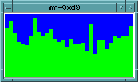

# gtk_perfbar

Minor updates to Doug Lea's GTK perfbar application for Linux.

Code originally from <http://gee.cs.oswego.edu/dl/code/>.

### CentOS 7 Linux (running in docker) building instructions

`$ make centos7_cuda8_in_docker`

This makes the **linux_perfbar** and **cuda_perfbar** binaries.

This works for both the x86_64 and ppc64le architectures.

### Linux building instructions

`$ cat /etc/redhat-release`

	CentOS release 6.5 (Final)
	
`$ sudo yum install gtk2-devel`  
`$ sudo yum install gtk2`  
`$ sudo yum groupinstall "Development Tools"`  

    [...Output not interesting...]

`$ make`

    gcc -O -DLINUX -pthread -I/usr/include/glib-2.0 -I/usr/lib64/glib-2.0/include -I/usr/include/gtk-2.0 -I/usr/lib64/gtk-2.0/include -I/usr/include/atk-1.0 -I/usr/include/cairo -I/usr/include/pango-1.0 -I/usr/include/pixman-1 -I/usr/include/freetype2 -I/usr/include/libpng12   -pthread -lgtk-x11-2.0 -lgdk-x11-2.0 -latk-1.0 -lgio-2.0 -lpangoft2-1.0 -lgdk_pixbuf-2.0 -lpangocairo-1.0 -lcairo -lpango-1.0 -lfreetype -lfontconfig -lgobject-2.0 -lgmodule-2.0 -lgthread-2.0 -lrt -lglib-2.0   -o linux_perfbar perfbar.c
    
Now you have a **linux_perfbar** binary.

### Linux running instructions

1.  Login to the target host you want to monitor.  (Skip this step if you are already on the host of interest.)  
`$ ssh -X username@hosthame`  
(If your X session information isn't forwarded properly and the **DISPLAY** environment variable isn't setup, you probably need to install xauth on the target host. `$ sudo yum install xauth` on the target host and then logout and re-login.)

2.  Start perfbar.  
`$ ./linux_perfbar`  

    

### How to interpret perfbar

* Each vertical bar represents one CPU in /proc/stat
* If hyperthreading is enabled, each hyperthread counts as one CPU
* Blue is idle time
* Green is user time
* Red is system time (i.e. in the kernel)
* White is other time (i/o time and nice time)

### Implementation notes

* The function get_times() is system-specific.  This is where Linux /proc/stat is read.
* /proc/stat contains monotonically increasing tick counts for each CPU
* See <http://www.linuxhowtos.org/System/procstat.htm> for /proc/stat documentation
* The display is updated 5 times a second, and would appear very jagged if the raw data were displayed.  A smoothing function is applied to assist visualization.

### Miscellaneous

It's worth pointing out that a **linux_perfbar** built on Centos 6.5 runs fine on this version of Ubuntu.

`$ cat /etc/lsb-release`  

    DISTRIB_ID=Ubuntu  
    DISTRIB_RELEASE=12.04  
    DISTRIB_CODENAME=precise  
    DISTRIB_DESCRIPTION="Ubuntu 12.04.5 LTS"  
